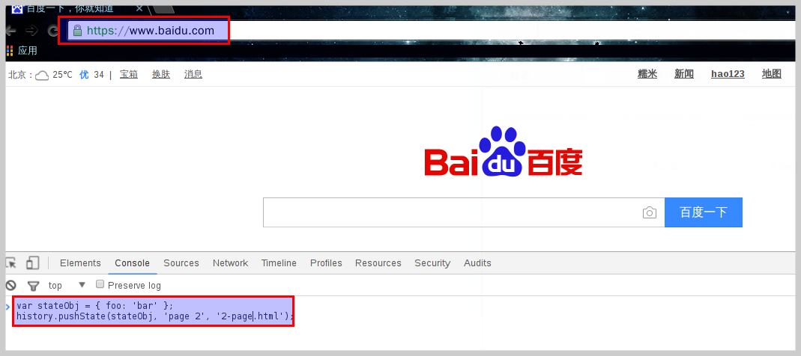
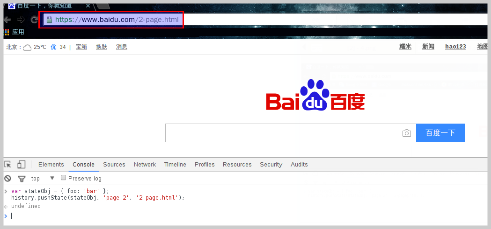
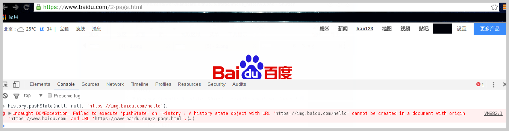
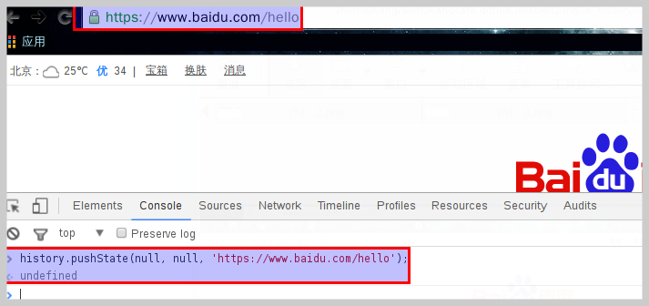
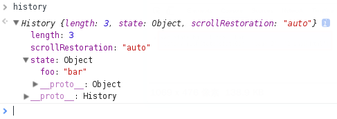

# History

<!-- toc -->

## History对象

[History](https://developer.mozilla.org/en-US/docs/Web/API/Window/history)对象是window对象的一部分，可通过window.history属性对其进行访问对浏览器历史记录的读取，内容为用户（在浏览器窗口中）访问过的URL。从HTML5开始，我们可以开始操作这个历史记录堆栈。


### History对象属性

通过检查浏览器历史记录的length属性来找到历史记录堆栈中的页面总数。

|属性|实例|描述|
| ---- | ---- | ---- |
|length|`var numberOfEntries = window.history.length;`|返回浏览器历史列表中的URL数量|

### History对象方法

使用back(),forward(),和go()方法可以在用户的历史记录中前进和后退。

|方法|实例|描述|
| ---- | ---- | ---- |
|back[^^windows_histroy_backup]|`window.history.back();`|加载history列表中的前一个URL|
|forward|`window.history.forward();`|加载history列表中的下一个URL|
|go[^^windows_histroy_go_ie]|`window.history.go(-1);`|加载history列表中的某个具体页面|

[^^windows_histroy_backup]:返回上一页时，页面通常是从浏览器缓存之中加载，而不是重新要求服务器发送新的网页。

[^^windows_histroy_go_ie]:IE支持向go()方法传URL参数。`history.go(0)`相当于刷新当前页面。


如果移动的位置超出了访问历史的边界，以上三个方法并不报错，而是默默的失败。

[Manipulating the browser history](https://developer.mozilla.org/en-US/docs/Web/API/History_API)


## HTML5扩展Histroy

html5通过`history.pushState`等接口扩展了`回退栈`等功能。即所有的变化只发生在前端，这种方式下url变化，但实际上该url所对应的页面很可能不存在，url部分只作为回退栈的tag而存在。

|方法|实例|描述|
| ---- | ---- | ---- |
|pushState|`history.pushState(data, title [, url])`|往历史记录堆栈顶部添加一条记录|
|replaceState|`history.replaceState(data, title [, url]) `|修改浏览历史中当前纪录|

|参数|参数描述|
| ---- | ---- |
|data|一个与指定网址相关的状态对象，onpopstate事件触发时，该对象会传入回调函数。如果不需要这个对象，此处可以填null|
|title|新页面的标题，但是所有浏览器目前都忽略这个值，因此这里可以填null|
|url|新的网址，必须与当前页面处在同一个域。浏览器的地址栏将显示这个网址|

通过`pushState`函数改变地址栏。



```js
var stateObj = { foo: 'bar' };
history.pushState(stateObj, 'page 2', '2-page.html');
```



pushState方法不会触发页面刷新，只是导致history对象发生变化，地址栏会有反应。如果第三个参数`url`是带有`http|https`等网络协议标识的锚点，就要注意跨域问题。

```js
history.pushState(null, null, 'https://img.baidu.com/hello');
```


不同源则报错。
```js
history.pushState(null, null, 'https://www.baidu.com/hello');
```


使用[how well does your browser support html5](http://html5test.com/)检查当前浏览器是否支持History API，不支持的话使用[Benjamin Lupton](https://balupton.com/)等人写的Polyfill库（[history.js](https://github.com/browserstate/history.js/)）扩展history。

```js
if (!!(window.history && history.pushState)){
  // 支持History API
} else {
  // 不支持
}
```

扩展使用window.history进行前端mvc跳转。

```js
if (!!(window.history && history.pushState))
 {   
   // 支持History API
    var stateObj = { foo: "bar" };
    history.pushState(stateObj, "page 2", "user.html");
    // 监听出栈事件
    window.addEventListener(window,'popstate',function onPopStack(evt){
         var e = evt || window.event;
         console.log("location: " + document.location);   
         console.log("state: " + JSON.stringify(event.state));
         console.dir(evt);  
    },true);

 }
else {  
 // 不支持
}
```
### pjax
<pre class="pre-no-border">
        .--.
       /    \
      ## a  a
      (   '._)
       |'-- |
     _.\___/_   ___pjax___
   ."\&gt; \Y/|&lt;'.  '._.-'
  /  \ \_\/ /  '-' /
  | --'\_/|/ |   _/
  |___.-' |  |`'`
    |     |  |
    |    / './
   /__./` | |
      \   | |
       \  | |
       ;  | |
       /  | |
 jgs  |___\_.\_
      `-"--'---'
</pre>

在现在追求用户体验的大环境下，主流网站都支持这样的一种浏览方式，当点击一个站内的链接的时候不做页面跳转，而是只是页面刷新变更地址栏目不变。页面变化内容是通过`AJAX`技术与后端进行交互，但是这样做有一个弊端，就是会破坏浏览器本身的回退功能，随着`html5`技术规范的推广，`history.pushState`的实现可以曲线解决这一问题。有人把`pjax = pushState + ajax`这种技术称之为[pjax](https://github.com/defunkt/jquery-pjax)。


### 其它

|方法|参数描述|
| ---- | ---- |
|history.state|返回当前页面的state对象|
|[window.onpopstate](https://developer.mozilla.org/en-US/docs/Web/API/WindowEventHandlers/onpopstate)[^^window_onpopstate_desc]|每当同一个文档的浏览历史（即history对象）出现变化时，就会触发popstate事件|
|URLSearchParams API[^^URLSearchParams_eericbidelman_desc]|URLSearchParams API用于处理URL之中的查询字符串，即问号之后的部分。没有部署这个API的浏览器，可以用[url-search-params](https://github.com/WebReflection/url-search-params)这个垫片库|

[^^window_onpopstate_desc]:需要注意的是，仅仅调用pushState方法或replaceState方法 ，并不会触发该事件，只有用户点击浏览器倒退按钮和前进按钮，或者使用JavaScript调用back、forward、go方法时才会触发。另外，该事件只针对同一个文档，如果浏览历史的切换，导致加载不同的文档，该事件也不会触发。页面第一次加载的时候，在load事件发生后，Chrome和Safari浏览器（Webkit核心）会触发popstate事件，而Firefox和IE浏览器不会。

[^^URLSearchParams_eericbidelman_desc]:[Eric Bidelman](https://developers.google.com/web/updates/2016/01/urlsearchparams?hl=en)



URLSearchParams有以下方法，用来操作某个参数。

|方法|参数描述|
| ---- | ---- |
|has()|返回一个布尔值，表示是否具有某个参数|
|get()[^^URLSearchParams_get_desc]|返回指定参数的第一个值|
|getAll()|返回一个数组，成员是指定参数的所有值|
|set()|设置指定参数|
|delete()|删除指定参数|
|append()|在查询字符串之中，追加一个键值对|
|toString()|返回整个查询字符串|
|keys()|遍历所有参数名|
|values()|遍历所有参数值|
|entries()|遍历所有参数的键值对|

[^^URLSearchParams_get_desc]:如果真值为假返回`null`,但是Firefox返回空字符串。

```js
var paramsString = 'q=URLUtils.searchParams&topic=api';
var searchParams = new URLSearchParams(paramsString);
searchParams.has('topic');
==> true
searchParams.get('topic');
==> "api"
searchParams.getAll('topic');
==> ["api"]
searchParams.get('foo');
==> null
searchParams.set('foo', 2);
searchParams.get('foo');
==> "2"
```
## 兼容状况

### 桌面浏览器

```
Session history management ✔ 83.99% ◒ 7.31% [WHATWG Living Standard]
  Method of manipulating the user's browser's session history in JavaScript using `history.pushState`,
  `history.replaceState` and the `popstate` event. #HTML5

  IE ✘ 5.5+ ✔ 10+
  Edge ✔  
  Firefox ✘ 2+ ✔ 4+
  Chrome ✘ 4+ ✔ 5+
  Safari ✘ 3.1+ ◒ 5+ ✔ 6+
  Opera ✘ 9+ ✔ 11.5+

   ⓘ  Older iOS versions and Android 4.0.4 claim support, but implementation is too buggy to be useful.
```

### 移动浏览器

```
Session history management ✔ 83.99% ◒ 7.31% [WHATWG Living Standard]
  Method of manipulating the user's browser's session history in JavaScript using `history.pushState`,
  `history.replaceState` and the `popstate` event. #HTML5

  IE ✘ 5.5+ ✔ 10+
  Edge ✔  
  Firefox ✘ 2+ ✔ 4+
  Chrome ✘ 4+ ✔ 5+
  Safari ✘ 3.1+ ◒ 5+ ✔ 6+
  Opera ✘ 9+ ✔ 11.5+
  iOS Safari ✘ 3.2+ ◒ 4.2-4.3+ ✔ 5.0-5.1+
  Opera Mini ✘  
  Android Browser ✘ 2.1+ ✔ 2.2+ ✘ 3+ ✔ 4.2-4.3+
  Blackberry Browser ✔  
  Opera Mobile ✘ 10+ ✔ 11.1+
  Chrome for Android ✔  
  Firefox for Android ✔  
  IE Mobile ✔  
  UC Browser for Android ◒  
  Samsung Internet ✔  

   ⓘ  Older iOS versions and Android 4.0.4 claim support, but implementation is too buggy to be useful.

```
